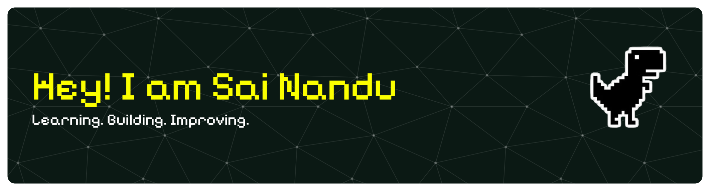

  

  
  
  
  <!-- <a href="https://codeforces.com/profile/5aitama" target="_blank">
     -->
  </a>
  

 

<h2 align="center"> <em>About Me</em></h2>

  Hello there! <em><b>I'm Vajhala Sai Nandu</b></em>, a B.Tech Computer Science student specializing in AI and Machine Learning, with a strong foundation in competitive programming and algorithmic problem-solving. My technical focus centers on building practical GenAI applications and full-stack backend systems. I am deeply passionate about open-source contribution and continuously adapting to modern developer tools.

 

<em><b>B.Tech CSE student specializing in AI & ML</b></em>  
<em><b>Competitive Programming & Problem Solving</b></em>  
<em><b>Machine Learning & GEN AI</b></em>  
<em><b>Open Source and Continuous Learning</b></em>

 
 

<h2 align="center"> <em>Tech Stack</em></h2>

<h3 align="center">Languages</h3>

  
  
  
  
  
  
  
  
  
  

<h3 align="center">Frameworks</h3>

  
  
  
  
  
  
  
  
  
  

<h3 align="center">Libraries & Tools</h3>

  
  
  
  
  
  
  
  
  
  
  
  

<h3 align="center">Machine Learning & Data</h3>

  
  
  
  
  
  
  
  
  

<h3 align="center">Databases</h3>

  
  
  
  
  
  
  

<h3 align="center">Cloud & Deployment</h3>

  
  
  
  
  
  
  

<h3 align="center">Developer Tools</h3>

  
  
  

 

<h2 align="center"> <em>Statistics</em></h2>

  

 

  <picture>
    <source media="(prefers-color-scheme: dark)" srcset="https://raw.githubusercontent.com/SaiNanduVajhala/SaiNanduVajhala/output/github-contribution-grid-snake-dark.svg">
    <source media="(prefers-color-scheme: light)" srcset="https://raw.githubusercontent.com/SaiNanduVajhala/SaiNanduVajhala/output/github-contribution-grid-snake.svg">
    
  </picture>

 

<h2 align="center"><em> GitHub Stats</em></h2>

  
  

